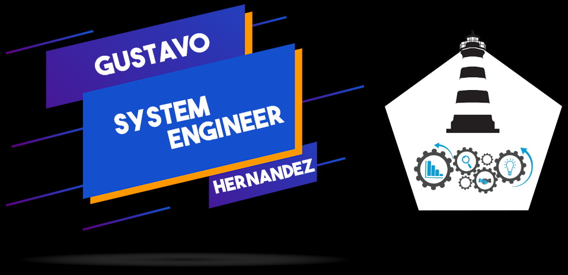

# Hi, I'm Gustavo

## Who I Am

My name is Gustavo Hernandez. I'm a systems engineer with a passion for making open source and technology more accessible, creating ideas to improve persons quality of life. I'm a big fan of JavaScript and Node. Some technologies I enjoy working with include Python and Docker. My interest in programming led me to meet wonderful people and new horizons.

## Skills:

## Learning

## Find me around the web:
[-339933?style=for-the-badge&logo=gmail&logoColor=white&labelColor=101010)](mailto:ghhernandez@protonmail.com)

  

  Made with &hearts; in Mexico City

