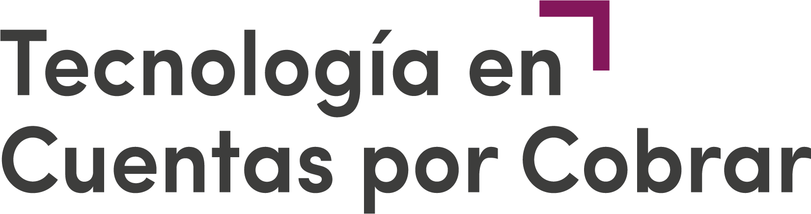

<h1 align="center">Hi, I'm Gustavo Hernandez</h1>

  

<h2 align="center">Who I am</h2>

Full-stack infrastructure specialist with 5+ years of experience in cloud architecture, DevOps, and Python development. I'm passionate about automating processes, optimizing systems, and making technology more accessible. I thrive on solving complex infrastructure challenges and continuously learning emerging technologies.

Currently managing cloud infrastructure on **GCP** while maintaining on-premise solutions. I'm a **JavaScript** and **Node.js** enthusiast with strong proficiency in **Python**, **Docker**, and infrastructure automation.

**Current Role:** Infrastructure Engineer @ [Tecnología en Cuentas por Cobrar](https://www.linkedin.com/company/tcxc/)  
**Currently Learning:** Rust, advanced GCP architectures, and infrastructure-as-code best practices

<h2>Professional Experience</h2>

### Infrastructure Engineer | Tecnología en Cuentas por Cobrar
**2019 - Present | 5+ years**

- **Cloud Infrastructure Management:** Designed and deployed cloud-native infrastructure on GCP, managing compute instances, networking, storage, and databases at scale
- **On-Premise Infrastructure Support:** Provided comprehensive Tier 1 support and maintenance for on-premise infrastructure, managing Hyper-V hypervisors with Windows and Linux VMs
- **End-User Support:** Delivered technical support to end-users, troubleshooting issues and ensuring smooth operations across the organization
- **Python Development:** Developed automation scripts and tools to streamline infrastructure management and reduce manual operational overhead
- **Infrastructure Automation:** Implemented automated deployment pipelines and infrastructure workflows
- **Continuous Learning:** Self-taught cloud technologies; rapidly adapted to GCP ecosystem and best practices

---

<h2>Skills & Experesise</h2>

<h3 align="center">Coding Languajes</h3>

<h3 align="center">Tools & Technologies:</h3>

<table align="center">
  <tr>
    <th>Category</th>
    <th>Tools</th>
  </tr>
  <tr>
    <td>Development Tools</td>
    <td>
        
        
        
        
        
        
        
        
    </td>
  </tr>
  <tr>
    <td>Data & Analytics</td>
    <td>
        
        
        
        
    </td>
  </tr>
  <tr>
    <td>Operating Systems</td>
    <td>
        
        
          
          
    </td>
  </tr>
  <tr>
    <td>Web Technologies</td>
    <td>
        
        
        
    </td>
  </tr>
  <tr>
    <td>Testing & QA</td>
    <td>
        
    </td>
  </tr>
  <tr>
    <td>Code Quality & Security</td>
    <td>
        
        
    </td>
  </tr>
  <tr>
    <td>Cloud Platform</td>
    <td>
        
        
    </td>
  </tr>
  <tr>
    <td>Version Control Hosting</td>
    <td>
        
        
    </td>
  </tr>
  <tr>
    <td>Design & Media</td>
    <td>
        
    </td>
  </tr>
  <tr>
    <td>Networking</td>
    <td>
        
        
    </td>
  </tr>
</table>

<h2>Featured Projects</h2>

### <a href="https://github.com/GustavoHdezH/Hydra-Rapute">🔥 Hydra-Rapute</a>

A high-performance command-line tool for parallel archive decompression. Hydra processes multiple compressed files simultaneously across various formats (ZIP, TAR.GZ, TAR, TAR.XZ, 7z) from a specified input directory and extracts their contents to an organized output structure, creating subfolders named after the original files.

**Key Features:**
- Parallel decompression for improved performance
- Support for multiple archive formats
- Automatic organization of extracted files
- Efficient batch processing

**Tech Stack:** Python • Rust • CLI Tools • Archive Processing

---

### <a href="https://github.com/GustavoHdezH/Decryptor">🔐 Decryptor</a>

A secure and efficient command-line decryption tool that simplifies the process of decrypting files. Decryptor handles popular encryption formats (GPG and Age) with support for asymmetric cryptography using public/private key pairs.

**Key Features:**
- Support for GPG and Age encryption formats
- Asymmetric cryptography (public/private key pairs)
- Fast and efficient decryption operations
- User-friendly command-line interface
- Secure handling of encrypted data

**How It Works:**
- **Public Key:** Can be shared with anyone; used to encrypt files for the key owner
- **Private Key:** Kept secret; used to decrypt files encrypted with the corresponding public key

**Tech Stack:** Rust • Cryptography • CLI Tools • Security

---

<h2>Currently Working On</h2>

  

Cloud infrastructure optimization and advanced GCP architecture design for enterprise-scale applications.

---

<h2 align="center">📫 Let's Connect!</h2>

I'm open to collaboration opportunities, technical discussions, mentorship, and exciting projects. Feel free to reach out!

  
  

**Email:** gusdezh@hotmail.com  
**LinkedIn:** [ghhernandezh](https://www.linkedin.com/in/ghhernandezh/)

---

  Made with &hearts; in Mexico City

